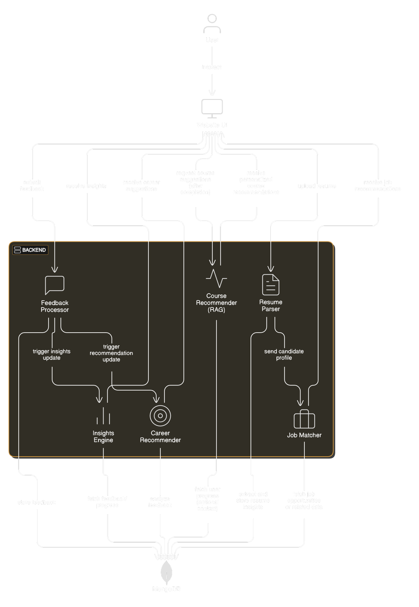
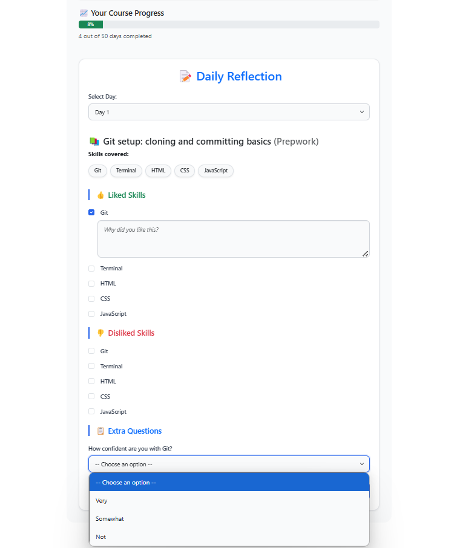
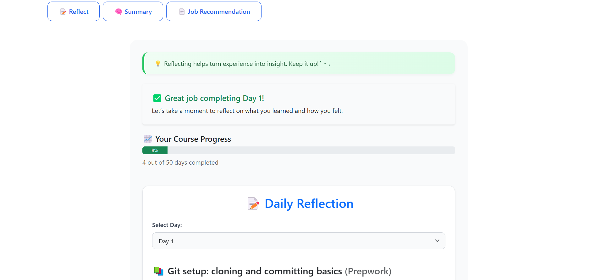
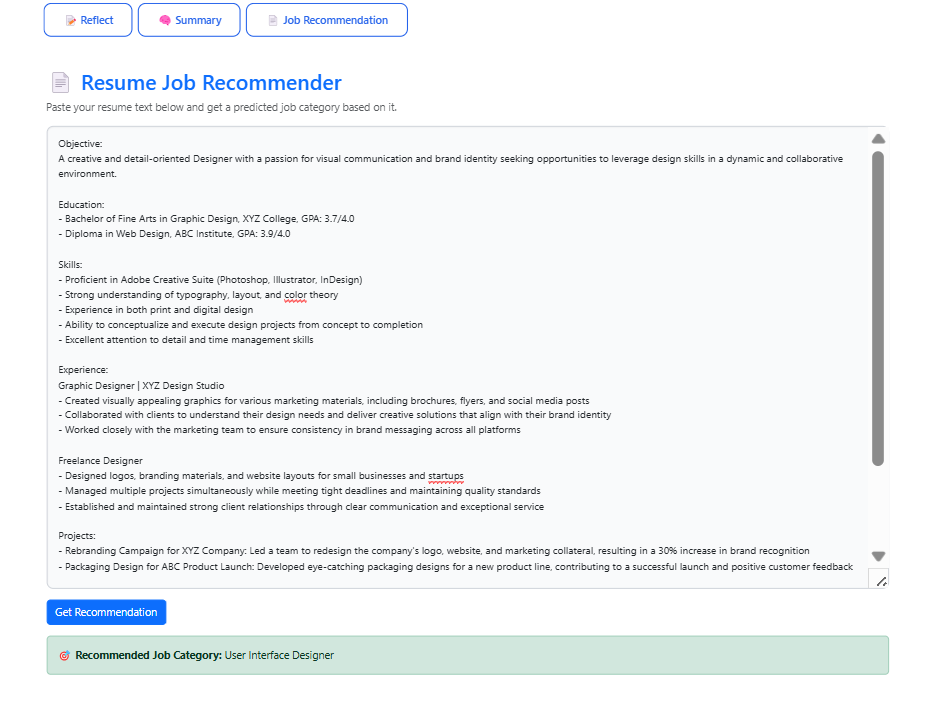
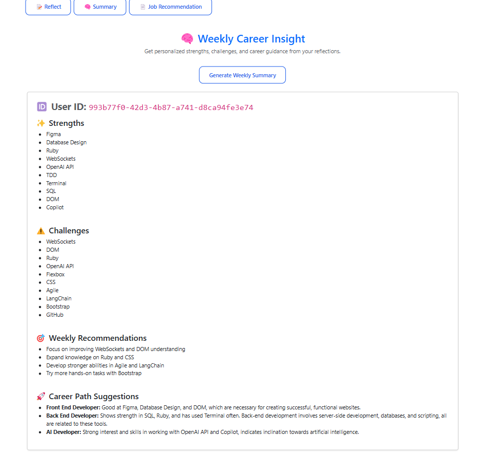

> Pathly transforms daily skill reflections into personalized growth maps, course suggestions, and career paths using LLMs and RAG.

---
## 📂 File Descriptions

| Path | Description |
|------|-------------|
| `backend/app.py` | 🔧 Main Flask application with API routes for reflections, job prediction, and course recommendations (RAG + OpenAI). |
| `backend/llm.py` | 🧠 Standalone script to run the LLM summary logic manually on local JSON reflection data. |
| `backend/feedback_50_days.json` | 📄 Sample dataset with user reflections across 50 days used for generating summaries. |
| `backend/Database/Feedbackform.py` | 📝 Handles reflection form data logic — used for structuring or validating input if needed. |
| `backend/Database/store_module.py` | 📦 Stores and manages course module metadata, possibly for future database migration. |
| `frontend/pathly/` | 🌐 React frontend for the app — includes reflection form, course recommender UI, and LLM summary viewer. |
| `frontend/pathly/src/pages/components/form/reflectionform.js` | 📋 React form for daily reflections. |
| `frontend/pathly/src/pages/components/form/progresstracker.js` | 📊 Displays student progress based on reflections. |
| `frontend/pathly/src/pages/components/recommend/recommendation.js` | 📚 Shows RAG-based course suggestions fetched from backend. |
| `frontend/pathly/src/pages/components/LLM/llmfrontend.js` | 💡 Renders LLM summary output including strengths, challenges, and paths. |

## Table of Contents

- [What It Does](#what-it-does)
- [Problem Statement](#problem-statement)
- [Our Solution](#our-solution)
- [Key Features](#key-features)
- [Tech Stack](#tech-stack)
- [Architecture](#architecture)
- [Screenshots / Demo](#screenshots--demo)
- [Acknowledgements](#acknowledgements)

---

## What It Does
Pathly is a smart, LLM-powered learning assistant built for students enrolled in intensive bootcamps. It collects daily feedback on what skills learners enjoyed or struggled with, then processes this data using AI to:

- Summarize learning journeys
- Identify personal strengths and challenges
- Suggest growth areas and tech stacks
- Recommend courses
- Match potential career paths and jobs

---

## Problem Statement
- Bootcamp students are overloaded with daily content and tasks.
- They struggle to understand what they’re mastering versus what they’re missing.
- There’s no structured way to reflect, track skills, or connect daily progress to career readiness.
- Most learners finish with unclear strengths and no guided path forward.

---

## Our Solution
Pathly collects daily reflections from learners over a 50-day course. Each entry includes:
- Liked & disliked skills selected by the user
- Reasons for their preferences (entered as comments)
- Confidence levels and tool ratings via extra feedback questions

Daily entries are stored in MongoDB, and each day’s submission also updates the learner’s progress.

On Day 50:
- GPT-4 reads the entire reflection history and produces a personalized summary
- The summary includes: key strengths, areas of struggle, and learning style patterns
- This summary is passed to a RAG-powered recommender that uses FAISS to search a curated corpus of technical courses
- Based on retrieved content, the system suggests ideal next courses and growth paths

The platform also includes:
- A Resume Uploader that will extract core skills and maps the learner’s skills suggest the role one must be applying to.

Together, Pathly not only summarizes learning but actively suggests what to learn next and where to grow.

---

## Key Features
- Daily Skill Reflections with context
- Progress Tracking across 50 days
- LLM Summary Generator on Day 50 (GPT-4)
- Course Recommendations via RAG
- Job Suggestions using resume skills 

---

## Tech Stack
- **Frontend:** React
- **Backend:** Flask (Python)
- **Database:** MongoDB 
- **LLM Engine:** OpenAI GPT-4
- **RAG Pipeline:** FAISS + Embedded Course Corpus

---

## Architecture

---

---

### Reflection

### Progress Tracker with Feedback input

### Job recommender

### Weekly Insights

---

## Acknowledgements
Acknowledgements

We’d like to extend our heartfelt thanks to *QHack Summit* and *Le Wagon* for providing the challenge and opportunity to build something impactful during this hackathon.

